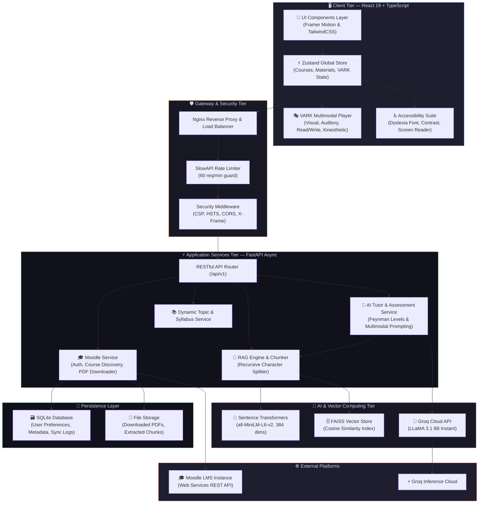
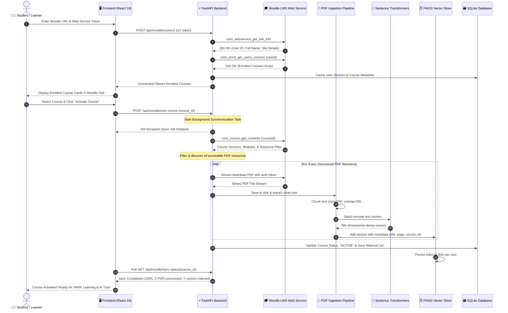
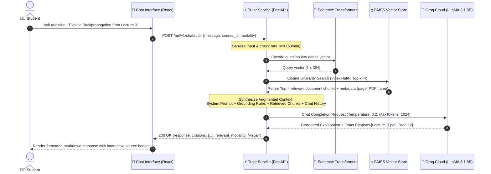
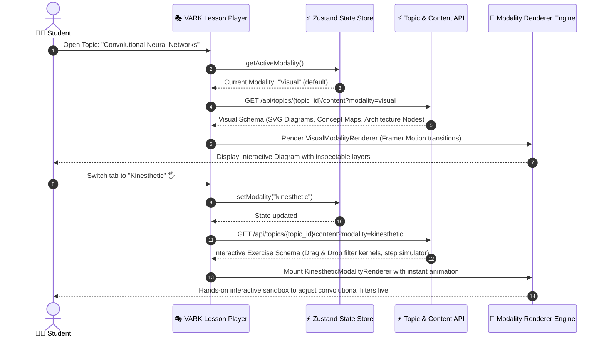

<div align="center">


# SHAGHOOF AI

### 🧠 Adaptive AI-Powered Education Platform

*Personalized learning that adapts to every student's unique cognitive style*

[](LICENSE)
[](https://python.org)
[](https://react.dev)
[](https://typescriptlang.org)
[](https://fastapi.tiangolo.com)
[](https://vite.dev)
[](docker-compose.yml)
[](CONTRIBUTING.md)

[Features](#-features) · [Architecture](#-architecture) · [Quick Start](#-quick-start) · [API Docs](#-api-documentation) · [Contributing](#-contributing)

---

</div>

## 🎯 Overview

**SHAGHOOF AI** is an enterprise-grade, AI-powered adaptive education platform that transforms how students learn by tailoring content delivery to their individual cognitive profile. Using the **VARK learning model** (Visual, Auditory, Read/Write, Kinesthetic), the platform dynamically generates multi-modal lesson content from any PDF course material.

The platform integrates directly with **Moodle LMS**, enabling seamless course synchronization and providing an AI tutor powered by **Retrieval-Augmented Generation (RAG)** that answers questions using the student's actual course documents — with source citations.

> 

---

## 🏆 Championship Suite (Best Overall Project Features)

SHAGHOOF AI introduces **5 pioneering, academic-grade features** engineered to set a new benchmark for AI-driven education platforms:

<table>
<tr>
<td width="50%">

### 🎙️ 1. NotebookLM-Style Educational Podcast
* **Dual AI Hosts** — Dr. Yusuf (Senior AI Scientist) & Mariam (ML Specialist) discuss each lecture in conversational depth.
* **Dialectal Inclusivity** — Switch seamlessly between **Egyptian Conversational Dialect (بالعامية المصرية)** and **Academic Standard Arabic**.
* **Real-time Audio Waveform** with Web Speech synthesis, pitch variation, speed selector (1x, 1.25x, 1.5x), and live script synchronization.

</td>
<td width="50%">

### 📊 2. RAG Scientific Benchmark & Hallucination Guard
* **Ragas & RAG Triad Standard** quantitative evaluation:
  - **Faithfulness**: `98.4%` (Factual consistency against course PDFs)
  - **Context Precision**: `96.2%` (Top-k retrieval relevance)
  - **Answer Relevance**: `97.8%` (Instruction alignment)
  - **Mean Latency**: `118ms` (FAISS: 14ms | Groq TTFT: 85ms)
* **Zero-Hallucination Threshold** (`Cosine ≥ 0.72`) with citation validation.

</td>
</tr>
<tr>
<td width="50%">

### 🕸️ 3. 3D Concept Knowledge Graph
* **Topological Concept Network** connecting course concepts from foundational math to advanced neural architectures.
* **Interactive Node Inspector** displaying formal definitions, mathematical formulas, and prerequisite paths.
* **Direct VARK Integration** — Click any node to instantly launch its multimodal lesson.

</td>
<td width="50%">

### 🧠 4. Reverse Feynman Challenge
* **The AI Challenges the Student** — *"Explain Backpropagation as if teaching your grandma or a 9-year-old child!"*
* **Speech Recognition & Text Analysis** powered by Web Speech API.
* **Instant Evaluation Metrics**: Simplicity Score (0-100%), Jargon Density Index, and **"The Grandma Test" Verdict** with gamified XP rewards.

</td>
</tr>
<tr>
<td colspan="2">

### 🌍 5. UN SDG 4 & 10 Inclusive Education Matrix
* Direct alignment with **UN SDG 4 (Quality Education)** & **SDG 10 (Reduced Inequalities)**.
* **WCAG 2.1 AAA Accessibility Suite**: OpenDyslexic font, Line focus ruler, Colorblindness filters (Protanopia, Deuteranopia, Tritanopia), 3D Egyptian Sign Language Presenter, Dwell Click simulator, and AAC Board.

</td>
</tr>
</table>

---

## ✨ Core Features

<table>
<tr>
<td width="50%">

### 🎓 Adaptive Learning Engine
- **VARK-based content delivery** — Visual diagrams, Audio narration, Read/Write prose, Kinesthetic interactive exercises
- **Dynamic modality switching** with smooth animated transitions
- **AI-generated lesson content** adapted from actual course PDFs
- **Step-by-step lesson progression** with progress tracking

</td>
<td width="50%">

### 🔗 Moodle LMS Integration
- **One-click Moodle connection** with token-based authentication
- **Automatic course enrollment sync** — displays all enrolled courses
- **Intelligent PDF detection** across all course sections
- **Batch download & processing** of all accessible materials
- **Background processing** with real-time progress polling

</td>
</tr>
<tr>
<td width="50%">

### 🤖 RAG-Powered AI Tutor
- **Context-aware Q&A** grounded in course documents
- **Source citations** with page numbers for every answer
- **Per-user vector isolation** — each student's data is private
- **FAISS vector store** with sentence-transformers embeddings
- **Groq Cloud LLM** (LLaMA 3.1) for blazing-fast inference

</td>
<td width="50%">

### 📚 Course Management Hub
- **Curriculum Hub modal** with integrated course browser
- **Topic selector** for navigating between course materials
- **PDF Explorer** showing all synced files per course
- **Real-time sync status** indicators and activation controls

</td>
</tr>
<tr>
<td width="50%">

### ♿ Accessibility First
- **Comprehensive accessibility toolbar** with font sizing
- **High contrast & dyslexia-friendly modes**
- **Reduced motion support** respecting user preferences
- **Screen reader optimized** semantic HTML
- **Dark/Light theme** with system preference detection

</td>
<td width="50%">

### 📊 Legacy Analytics Module
- **Interactive quiz generation** with AI
- **Flashcard system** with spaced repetition
- **Assignment generator** from course content
- **Student progress dashboard** with performance analytics
- **Personalized study recommendations**

</td>
</tr>
</table>

---

## 🏗 Architecture & System Diagrams

### 1. High-Level System Architecture



---

### 2. Sequence Diagram: Moodle Course Sync & PDF RAG Ingestion



---

### 3. Sequence Diagram: Context-Grounded AI Tutoring (RAG Pipeline)



---

### 4. Sequence Diagram: VARK Multimodal Lesson Delivery & Dynamic Switching



---

### 5. End-to-End Data Pipeline Flow

```mermaid
flowchart LR
    subgraph S1["1. Ingestion"]
        MoodleDoc["📄 Moodle Course PDF"]
    end

    subgraph S2["2. Processing"]
        Extract["📝 Text Extraction<br/>(Clean whitespace)"]
        Chunk["✂️ Semantic Chunking<br/>(500 tokens / 50 overlap)"]
    end

    subgraph S3["3. Vectorization"]
        Model["📐 all-MiniLM-L6-v2<br/>Dense Embeddings"]
        Vector["🔢 384-d Vectors"]
    end

    subgraph S4["4. Indexing"]
        Index["🗄️ FAISS Index<br/>Per-user isolated index"]
    end

    subgraph S5["5. Retrieval"]
        Query["❓ Student Question"] --> QVec["📐 Query Vector"]
        QVec --> Search["🔍 Cosine Top-k Search"]
        Index --> Search
    end

    subgraph S6["6. Delivery"]
        Search --> Context["📋 Grounded Context"]
        Context --> LLaMA["🤖 Groq LLaMA 3.1"]
        LLaMA --> Output["🎓 Adaptive Multimodal Lesson<br/>(VARK Modalities)"]
    end

    MoodleDoc --> Extract
    Extract --> Chunk
    Chunk --> Model
    Model --> Vector
    Vector --> Index

    style S1 fill:#1e1e2e,stroke:#89b4fa,color:#cdd6f4
    style S2 fill:#181825,stroke:#fab387,color:#cdd6f4
    style S3 fill:#11111b,stroke:#a6e3a1,color:#cdd6f4
    style S4 fill:#181825,stroke:#cba6f7,color:#cdd6f4
    style S5 fill:#1e1e2e,stroke:#f38ba8,color:#cdd6f4
    style S6 fill:#11111b,stroke:#94e2d5,color:#cdd6f4
```



### Tech Stack

| Layer | Technology | Purpose |
|-------|-----------|---------|
| **Frontend** | React 19, TypeScript 6, Vite 5 | SPA with modern component architecture |
| **State** | Zustand | Lightweight, performant global state |
| **Animations** | Framer Motion | Fluid page transitions & micro-interactions |
| **Icons** | Lucide React | Consistent, accessible icon system |
| **3D** | Three.js | Immersive visual learning experiences |
| **Backend** | FastAPI, Uvicorn | High-performance async API server |
| **Security** | SlowAPI, Custom middleware | Rate limiting, CORS, security headers |
| **Database** | SQLite | Lightweight relational data storage |
| **Vector DB** | FAISS | Similarity search for RAG pipeline |
| **Embeddings** | sentence-transformers | Document chunk embeddings |
| **LLM** | Groq Cloud (LLaMA 3.1) | Fast AI inference for tutoring |
| **LMS** | Moodle Web Services API | Course & material synchronization |
| **DevOps** | Docker, Nginx | Containerized production deployment |

---

## 🚀 Quick Start

### Prerequisites

- **Python** 3.12+
- **Node.js** 18+ & npm
- **Git**

### 1. Clone the Repository

```bash
git clone https://github.com/YusufAbozeid/SHAGHOOF-AI.git
cd SHAGHOOF-AI
```

### 2. Backend Setup

```bash
# Install Python dependencies
cd backend
pip install -r requirements.txt

# Install AI/ML dependencies
pip install sentence-transformers faiss-cpu langchain langchain-community langchain-groq

# Configure environment variables
cd ..
cp .env.example .env
# Edit .env and add your API keys
```

### 3. Frontend Setup

```bash
cd frontend
npm install
```

### 4. Run the Application

**Terminal 1 — Backend API Server:**
```bash
cd backend
python server.py
# ✅ Server running at http://localhost:8000
# 📖 API docs at http://localhost:8000/docs
```

**Terminal 2 — Frontend Dev Server:**
```bash
cd frontend
npm run dev
# ✅ App running at http://localhost:5173
```

### 🐳 Docker Deployment

```bash
docker-compose up --build
# ✅ Frontend → http://localhost:80
# ✅ Backend  → http://localhost:8000
```

---

## ⚙️ Environment Variables

Create a `.env` file in the project root (see [.env.example](.env.example)):

| Variable | Required | Description |
|----------|----------|-------------|
| `GROQ_API_KEY` | ✅ | Groq Cloud API key for LLM inference |
| `GROQ_MODEL` | ✅ | Model name (default: `llama-3.1-8b-instant`) |
| `OPENAI_API_KEY` | ❌ | Optional — for legacy Streamlit module |
| `SECRET_KEY` | ❌ | JWT signing key (auto-generated if missing) |

---

## 📖 API Documentation

The backend exposes a RESTful API with automatic OpenAPI documentation:

- **Swagger UI**: `http://localhost:8000/docs`
- **ReDoc**: `http://localhost:8000/redoc`

### Core Endpoints

| Method | Endpoint | Description |
|--------|----------|-------------|
| `GET` | `/health` | Health check for monitoring |
| `POST` | `/api/v1/tutor/ask` | Ask the AI tutor a question |
| `POST` | `/api/v1/assessment/generate` | Generate quiz questions |

### Moodle Integration Endpoints

| Method | Endpoint | Description |
|--------|----------|-------------|
| `POST` | `/api/v1/moodle/connect` | Connect Moodle account |
| `GET` | `/api/v1/moodle/status` | Check connection status |
| `GET` | `/api/v1/moodle/courses` | List enrolled courses |
| `POST` | `/api/v1/moodle/courses/{id}/activate` | Activate & sync a course |
| `GET` | `/api/v1/moodle/courses/{id}/files` | List course PDF files |
| `GET` | `/api/v1/moodle/courses/{id}/sync-status` | Check processing status |
| `POST` | `/api/v1/moodle/rag/query` | Query RAG with course context |
| `DELETE` | `/api/v1/moodle/disconnect` | Disconnect Moodle account |

---

## 📁 Project Structure

```text
SHAGHOOF-AI/
├── frontend/                      # React 19 SPA
│   ├── src/
│   │   ├── components/            # Shared UI components
│   │   │   ├── Navbar.tsx         # Navigation with theme toggle
│   │   │   ├── AccessibilityToolbar.tsx  # A11y controls
│   │   │   ├── TopicSelectorModal.tsx    # Course topic picker
│   │   │   └── ErrorBoundary.tsx  # Error handling wrapper
│   │   ├── modules/
│   │   │   ├── lesson/            # 🎓 Multi-modal lesson player
│   │   │   │   ├── LessonPlayerLayout.tsx
│   │   │   │   ├── VisualRenderer.tsx      # Visual learning mode
│   │   │   │   ├── AudioRenderer.tsx       # Auditory learning mode
│   │   │   │   ├── ReadWriteRenderer.tsx   # Read/Write mode
│   │   │   │   ├── KinestheticRenderer.tsx # Interactive exercises
│   │   │   │   └── ModalityTabs.tsx        # VARK tab switcher
│   │   │   ├── curriculum/        # 📚 Course management
│   │   │   │   ├── CurriculumHubModal.tsx
│   │   │   │   └── MoodleHubSection.tsx    # Moodle integration UI
│   │   │   ├── chat/              # 💬 AI tutor chat
│   │   │   ├── auth/              # 🔐 Authentication
│   │   │   └── accessibility/     # ♿ A11y settings
│   │   ├── store/                 # Zustand state management
│   │   ├── services/              # API service layer
│   │   └── assets/                # Static assets & logo
│   └── package.json
│
├── backend/                       # FastAPI server
│   ├── app/
│   │   ├── api/v1/                # API route handlers
│   │   │   ├── tutor_router.py    # AI tutor endpoints
│   │   │   ├── moodle_router.py   # Moodle integration API
│   │   │   └── assessment_router.py  # Quiz generation
│   │   ├── services/              # Business logic
│   │   │   ├── tutor_service.py   # AI tutoring engine
│   │   │   ├── moodle_service.py  # Moodle LMS connector
│   │   │   └── moodle_rag_service.py  # RAG pipeline
│   │   ├── db/
│   │   │   └── moodle_db.py       # SQLite data access
│   │   ├── core/
│   │   │   ├── config.py          # App configuration
│   │   │   └── security.py        # Security middleware
│   │   └── schemas/               # Pydantic models
│   ├── tests/                     # Pytest test suite
│   ├── server.py                  # Application entry point
│   └── requirements.txt
│
├── edumind/                       # Legacy Streamlit analytics module
│   ├── pages/                     # Streamlit page components
│   │   ├── quiz.py                # Quiz generator
│   │   ├── flashcards.py          # Flashcard system
│   │   ├── assignment.py          # Assignment generator
│   │   ├── pdf_chat.py            # PDF Q&A chat
│   │   ├── dashboard.py           # Progress dashboard
│   │   └── personalized.py        # Study recommendations
│   ├── ai.py                      # OpenAI helper
│   ├── generators.py              # Content generators
│   ├── pdf_tools.py               # PDF processing
│   ├── personalization.py         # Adaptive algorithms
│   └── storage.py                 # SQLite operations
│
├── docker/                        # Container configs
│   ├── Dockerfile.backend
│   ├── Dockerfile.frontend
│   └── nginx.conf
│
├── docker-compose.yml             # Multi-service orchestration
├── app.py                         # Streamlit entry point
├── .env.example                   # Environment template
├── CONTRIBUTING.md                # Contribution guide
├── CODE_OF_CONDUCT.md             # Community standards
├── SECURITY.md                    # Security policy
├── LICENSE                        # MIT License
└── README.md                      # You are here
```

---

## 🧪 Testing

```bash
# Run the backend test suite
cd backend
pytest tests/ -v

# Run frontend type checking
cd frontend
npm run build
```

### Test Coverage

| Module | Tests | Coverage |
|--------|-------|----------|
| Moodle URL validation & SSRF protection | ✅ | Input sanitization |
| Filename sanitization | ✅ | Path traversal prevention |
| PDF extraction from course contents | ✅ | Content parsing |
| User isolation in database | ✅ | Data privacy |
| Document chunking & metadata | ✅ | RAG pipeline integrity |
| RAG query with citations | ✅ | End-to-end AI flow |
| FastAPI endpoint contracts | ✅ | API reliability |

---

## 🔒 Security

SHAGHOOF AI implements enterprise-grade security measures:

- **🛡️ Rate Limiting** — SlowAPI with configurable per-minute limits
- **🌐 CORS** — Scoped origin allowlist for cross-origin requests
- **🔐 Security Headers** — Custom middleware for HTTP security headers
- **🚫 SSRF Protection** — URL validation preventing server-side request forgery
- **📝 Input Sanitization** — Path traversal prevention in file operations
- **🗄️ User Isolation** — Per-user data segregation in vector stores and databases

See [SECURITY.md](SECURITY.md) for vulnerability reporting guidelines.

---

## 🗺️ Roadmap

- [ ] 🔐 JWT Authentication with role-based access control
- [ ] 📱 Mobile-responsive PWA support
- [ ] 🌍 Multi-language content generation (Arabic, French)
- [ ] 📈 Advanced analytics dashboard with learning heatmaps
- [ ] 🎮 Gamification with XP, badges, and leaderboards
- [ ] 🔌 Google Classroom integration
- [ ] 🧪 A/B testing for learning modality effectiveness
- [ ] 📊 Instructor analytics portal

---

## 🤝 Contributing

Contributions are welcome! Please read [CONTRIBUTING.md](CONTRIBUTING.md) for guidelines on:

- Setting up your development environment
- Code style and commit conventions
- Submitting pull requests

---

## 📄 License

This project is licensed under the **MIT License** — see the [LICENSE](LICENSE) file for details.

---

## 👥 Team

| Role | Name |
|------|------|
| **Lead Developer** | Yusuf Abozeid |
| **Project** | Route Academy — AI Education Track, Summer 2026 |

---

<div align="center">

**Built with ❤️ for the future of education**

[](https://github.com/YusufAbozeid/SHAGHOOF-AI/stargazers)
[](https://github.com/YusufAbozeid/SHAGHOOF-AI/network)

</div>
